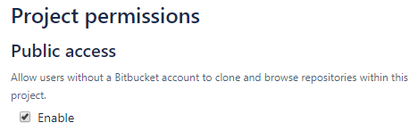
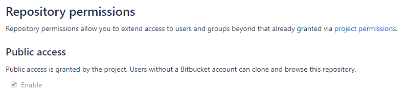
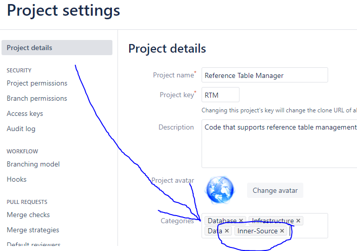
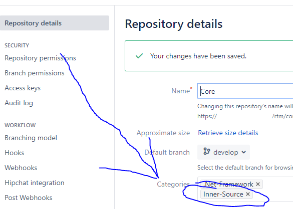
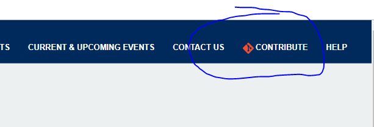

# Scorecard

## Questions

1. [Is your code in Bitbucket? (30pts)](#code-in-Bitbucket)
2. [Does your code allow "Public access" (really internally public)? (30pts)](#public-access)
3. [Does your code contain a README.md file? (20pts)](#README-file)
4. [Does your README.md document how bugs and suggestions should be reported? (20pts)](#document-bugs-suggestions)
5. [Does your code contain a CONTRIBUTING.md file? (30pts)](#CONTRIBUTING-file)
6. [Have you added the Inner-Source category label to your repository or project? (10pts)](#category-label)
7. [If your code has a GUI, do you have a Contribute link? (10pts)](#contribute-link)
8. [If your code has a GUI, do you have a Project Page link? (10pts)](#project-page-link)
9. [Do you keep a CHANGELOG.md file? (10pts)](#CHANGELOG-file)

## <a name="code-in-Bitbucket"></a> Is your code in Bitbucket? (30pts)

Why BitBucket? Why not TFS or MKS? Simple: the platform fosters open collaboration and communication and the latter do not

* Code is open and easily viewable thru a web browser to everyone within the agency firewall
* Any Bitbucket user can comment on someone else code just by clicking on a line number
* Contributions via pull requests are easy to create; the dialogue they generate is preserved and accessible through a web GUI
* Non-developers can even make contributions

When it comes to TFS, it has similar functionality, but unfortunately it's closed and limited to just the project team. We've worked w/ the agency's TFS Administrator to try to make TFS more open and accessible, but it seems to be a platform limitation.

Getting your code into Bitbucket is the first step in being inner source.

## <a name="public-access"></a> Does your code allow "Public access" (really internally public)? (30pts)

Your code is in Bitbucket? Great! Now make sure that other agency staff can access it. The default behavior is that it has "Public access" as shown below. If you left the default, great! If not, you should enable "Public Access". Don't worry, it's not really "public access" as in the general public; "public access" as far as our Bitbucket is concerned basically means any authenticated user view the code. Once that is enabled, then anyone will be able to create a pull request to suggest changes to your code.

### Access Project level



### Access Repository level



## <a name="README-file"></a> Does your code contain a README.md file? (20pts)

A README file is a critical way to document your code at a high level. If you need any help getting started with writing a good readme file, let us help you >> <https://www.google.com/search?q=what%27s+in+a+good+readme+file>

## <a name="document-bugs-suggestions"></a> Does your README.md document how bugs and suggestions should be reported? (20pts)

Since the README is the landing page for a repo, we recommend telling users how they can report bugs or make suggestions. Also, adding a link to your agile workflow tool (JIRA or VersionOne) will help users see what bugs have already been reported.

## <a name="CONTRIBUTING-file"></a> Does your code contain a CONTRIBUTING.md file? (30pts)

“A CONTRIBUTING.md file, in your repository or site, provides potential project contributors with a short guide to how they can help with your project or study group. It is convention to capitalize the word "contributing" as the file title, and to save it as a resource in markdown (hence the extension .md). Read more <https://mozillascience.github.io/working-open-workshop/contributing/>

## <a name="category-label"></a> Have you added the Inner-Source category label to your repository or project? (10pts)

Adding the Inner-Source label to your project or repository makes it easy for interested contributors to find code that they can lend a hand on.

### Category Project level



### Category Repository level



## <a name="contribute-link"></a> If your code has a GUI, do you have a Contribute link? (10pts)

If your code has a GUI, then you should consider adding a Contribute link that directs back to the code project or repository in bitbucket. This adds a great layer of transparency to the code and **encourages collaboration**.

There are multiple approaches to doing this. The below examples are using a variation of this:

### Contribution Link Example

```html
<a id="contributeLink" href="https://YOUR_LINK_TO_YOUR_BITBUCKET_REPOSITORY" rel="contribute" target="_blank">
     Contribute
</a>
```

### Sample



## <a name="project-page-link"></a> If your code has a GUI, do you have a Project Page link? (10pts)

If your code has a GUI, then you should consider adding a Project Page link that directs back to the homepage of the project or repository. Most of the time this would be a confluence page or SharePoint site. This adds a great layer of transparency to the code and **encourages collaboration**.

There are multiple approaches to doing this. The below examples are using a variation of this:

### Project Page Link Example

```html
<a id="projectPageLink" href="https://YOUR_LINK_TO_YOUR_PROJECT_PAGE" rel="projectPage" target="_blank">
     Project Page
</a>
```

## <a name="CHANGELOG-file"></a> Do you keep a CHANGELOG.md file? (10pts)

Keeping track of what gets changed is helpful for potential collaborators (and to, well, everyone else). Read more here: <https://keepachangelog.com/>

The level of detail in the CHANGELOG.md file depends on the circumstances:

* For a repository (module) that is designed to be used by multiple teams, the change log should be updated for every instance of the module that gets published.
* For a repository (module) that is an intricate part of a larger project, and is only used by that project, especially when under heavy development by a number of developers at the same time, updating the change log for every change is very impractical. If for instance three developers have pull requests out for the module, having a detailed change log would require those developers to closely coordinate who merges in which order, and every merge would result in a merge conflict in the CHANGELOG.md file which needs to be resolved. In such situations, it would make more sense to only update CHANGELOG.md for breakingchanges.
* For repositories that maintain an application, "releases" of the application are typically a business process that includes a process of stabilizing the application through a Release Candidate branch. In such cases, a location on e.g. Confluence would be more appropriate to maintain a list of releases and the business functionality in each release. The CHANGELOG.md file would potentially only have a reference to this confluence location.
